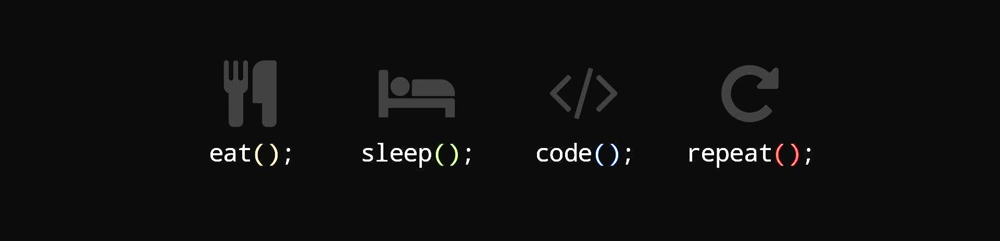

  

<h1 align="left">
  Hi , I'm Parship!
</h1>

<h3 align="left">About Me</h3>

  Hi, I'm <b>Parship Chowdhury</b> - a technology enthusiast. I'm passionate about learning new technologies and contributing on innovative <b>open-source projects</b>

  
  <b>Fun fact:</b> <i>My favorite sound? The silence after hitting "run" and not seeing a single error.</i>

-----------------------------------------------------------------------------------
<h3 align="left">Tech Stack I Work With</h3>

  
  
  
  
  
  
  
  
  
  
  
  
  
  
  
  
  
  
  
  
  
  
  
  
  

<h3 align="left">Connect with me:</h3>

  
  
  

